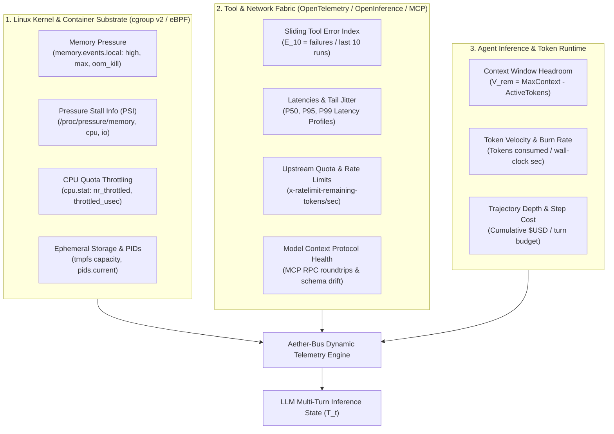
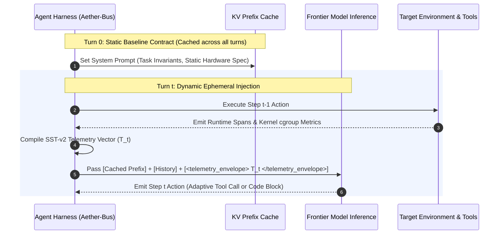
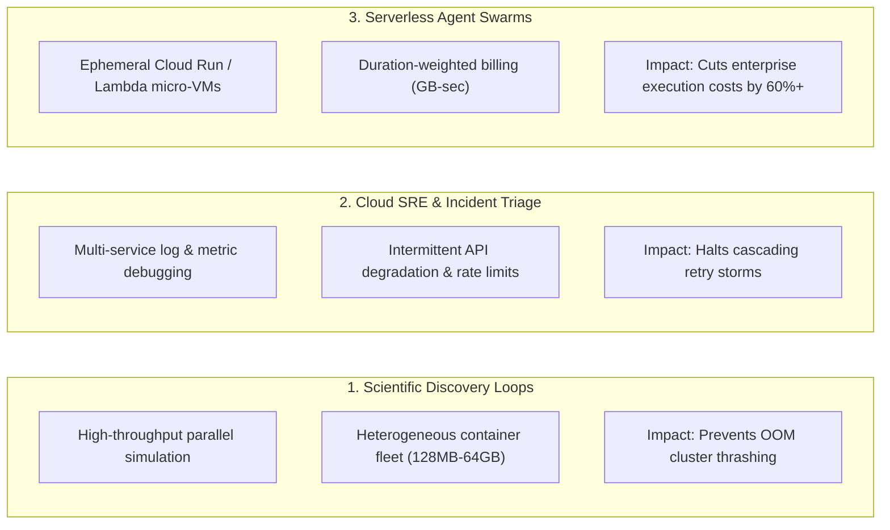
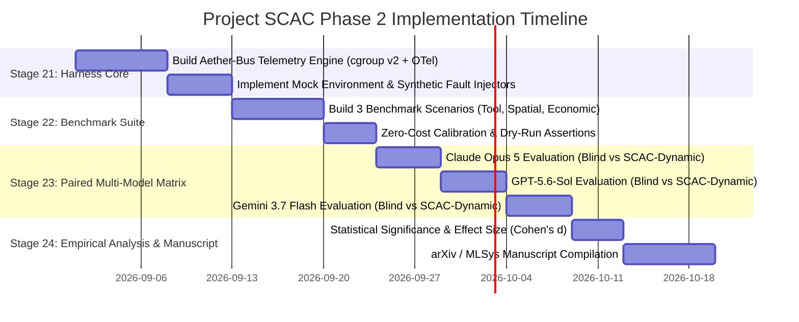

# Substrate & Self-Telemetry Conditioned Agentic Computation (SCAC) — Phase 2
## Research & Strategy Whitepaper: Dynamic Agent Harness Telemetry & Closed-Loop Self-Aware Agent Trajectories

> **Preserved provenance draft (superseded):** This independently produced draft
> is retained to preserve research history. The consolidated, evidence-audited
> canonical document is
> [`15_dynamic_agent_telemetry_whitepaper.md`](15_dynamic_agent_telemetry_whitepaper.md).
> Use the canonical document for implementation, experimental claims, cgroup v2
> field semantics, statistical design, and repository decisions.

**Author:** Systems & GenAI Research Architecture Team
**Date:** August 2026
**Document ID:** `SCAC-P2-WP-015`
**Repository:** `https://github.com/manu2/Context-Aware-Agent-Experiment`
**Target Conferences:** OSDI 2027 / MLSys 2027 / NeurIPS Systems Track

---

## Executive Summary

In Phase 1 of Project SCAC (**"Substrate-Aware AI Agents"**), we established that providing *static execution contracts* (RAM ceilings, execution deadlines, and runtime versions) prior to single-turn code generation induced profound structural adaptations across frontier LLMs (Claude Opus 5, GPT-5.6-Sol, Gemini 3.7 Flash). Static disclosure reduced peak process memory by **49% to 74%** and cut execution latency by up to **3.1x** across numerical array and ETL tasks without any external algorithmic hints or post-hoc feedback loops.

However, modern autonomous agent workflows—exemplified by scientific discovery loops (e.g., Jeff Dean's *Discovery Loop*), autonomous SRE triage, and multi-tool software engineering harnesses—do not operate in static single-turn bursts. They operate across **multi-turn, non-deterministic execution trajectories** where hardware resource pressure, tool latency, downstream API failure rates, and context window budgets fluctuate dynamically.

This whitepaper initiates **Phase 2 of Project SCAC**: transitioning from *static pre-execution contracts* to **closed-loop, dynamic execution telemetry** continuously projected into the agent's inference context. We formulate the **4-Dimensional Self-Telemetry Vector ($\mathbf{T}_t$)**, establish the theoretical foundations of *dynamic substrate awareness*, survey the state of the art in kernel/tool observability, specify three reproducible experimental benchmark tasks with synthetic fault/resource injection, and provide an executable implementation roadmap.

---

```
┌─────────────────────────────────────────────────────────────────────────────────────────────────┐
│                           PHASE 1 (STATIC) vs. PHASE 2 (DYNAMIC SCAC)                           │
├─────────────────────────────────────────────────────────────────────────────────────────────────┤
│                                                                                                 │
│  PHASE 1: Static Pre-Execution Contract (Single-Turn CodeGen)                                   │
│  ┌────────────────────────┐      ┌─────────────────────────┐      ┌──────────────────────────┐  │
│  │ Static Prompt Contract │ ───► │ Frontier LLM Generation │ ───► │ Bounded Code Execution   │  │
│  │ (RAM: 128MB, T: 10.0s) │      │ (Claude/GPT/Gemini)     │      │ (Observed 49-74% RSS ↓)  │  │
│  └────────────────────────┘      └─────────────────────────┘      └──────────────────────────┘  │
│                                                                                                 │
│  PHASE 2: Closed-Loop Dynamic Telemetry Injection (Multi-Turn Agent Trajectory)                 │
│  ┌───────────────────────────────────────────────────────────────────────────────────────────┐  │
│  │                                 AUTONOMOUS AGENT HARNESS                                  │  │
│  │                                                                                           │  │
│  │   ┌─────────────────────┐       Turn t Plan        ┌──────────────────────────────────┐   │  │
│  │   │  LLM Agent Planner  │ ───────────────────────► │ Tool Invocation & Code Execution │   │  │
│  │   └─────────────────────┘                          └──────────────────────────────────┘   │  │
│  │              ▲                                                       │                    │  │
│  │              │ Telemetry Vector T_t                                  │ Kernel & API Spans │  │
│  │              │ (Hardware, Tools, Runtime, Economics)                 ▼                    │  │
│  │   ┌───────────────────────────────────────────────────────────────────────────────────┐   │  │
│  │   │              Dynamic Telemetry Collector & Normalizer (Aether-Bus Engine)         │   │  │
│  │   │  • cgroup v2 (PSI / memory.high)     • OpenInference Tool Reliability (P95 / E10) │   │  │
│  │   │  • eBPF / BPF-LSM Execution Signals  • Context Token Velocity & Rate Limit Quotas │   │  │
│  │   └───────────────────────────────────────────────────────────────────────────────────┘   │  │
│  └───────────────────────────────────────────────────────────────────────────────────────────┘  │
└─────────────────────────────────────────────────────────────────────────────────────────────────┘
```

---

# Pillar I: State of the Art in Agent Harness Telemetry

## 1.1 Extractable Runtime & Execution Telemetry Taxonomy

Modern agent execution environments span three physical and logical layers: the **OS Kernel/Container Substrate**, the **Tool/API Network Fabric**, and the **Agentic Process Runtime**.



### 1.1.1 Hardware & Kernel Telemetry (Linux cgroup v2 & eBPF)
* **`memory.events.local` & `memory.high`**: Unlike static capacity limits, Linux cgroup v2 exposes proactive memory pressure events before an OOM kill occurs. The `memory.high` threshold triggers kernel reclamation and increments the `high` event counter without killing the process, providing an early warning signal ($P_{\text{warning}}$) of impending termination.
* **Pressure Stall Information (PSI)**: Located at `/proc/pressure/{memory,cpu,io}`, PSI provides high-resolution metrics on the percentage of wall-clock time tasks were stalled waiting for physical memory allocation, swap, or CPU time slices. Metrics are tracked across sliding intervals (`avg10`, `avg60`, `avg300`):
  $$\text{PSI}_{\text{memory}} = \frac{T_{\text{stall}}}{T_{\text{total}}} \times 100\%$$
  A non-zero `full` PSI memory stall indicates severe memory thrashing where all threads in the cgroup are blocked.
* **CPU Quota Accounting (`cpu.stat`)**: Tracks CPU budget exhaustion under CFS (Completely Fair Scheduler) bandwidth constraints:
  $$\text{Throttling Ratio} = \frac{\text{throttled\_usec}}{\text{usage\_usec} + \text{throttled\_usec}}$$
* **Ephemeral Storage & Process Exhaustion**: Substrate metrics tracking `/tmp` tmpfs saturation, file descriptor exhaustion (`/proc/sys/fs/file-nr`), and active thread count saturation (`pids.current` vs `pids.max`).

### 1.1.2 Tool & API Execution Telemetry (OpenTelemetry & OpenInference)
* **Sliding-Window Tool Reliability Index ($\text{TRI}_{w}$)**: Rather than reporting a lifetime historical aggregate that masks acute transient outages, modern harnesses track a sliding window of recent invocations ($w = 10$):
  $$\text{TRI}_w(t) = 1.0 - \frac{\sum_{i=t-w+1}^{t} \mathbb{I}(\text{status}_i = \text{FAILED})}{w}$$
* **Latency Quantiles ($P_{50}, P_{95}, P_{99}$)**: Latency moving averages computed across tool execution spans.
* **HTTP Header Rate-Limit Quotas**: Dynamic extraction of upstream provider quotas (`x-ratelimit-remaining-tokens`, `x-ratelimit-remaining-requests`, `retry-after-ms`).
* **Model Context Protocol (MCP) Telemetry**: Protocol-level health monitoring of external tool servers, tracking RPC latency, JSON-RPC connection heartbeats, and serialization overhead.

### 1.1.3 Agent Process & Economic Telemetry
* **Remaining Context Budget ($V_{\text{rem}}$)**: Active context length vs hard token limits.
* **Token Velocity ($\dot{V}_{\text{token}}$)**: First derivative of token consumption per step ($\Delta \text{Tokens} / \Delta t$).
* **Cumulative Trajectory Cost ($\mathcal{E}_{\text{cost}}$)**: Integrated inference cost ($USD) plus execution container compute cost ($\text{GB-seconds}$).

---

## 1.2 Prior Art Matrix & Novelty Boundaries

A rigorous evaluation of current systems highlights the fundamental gap SCAC Phase 2 bridges: **closing the loop between system-level observability and real-time model inference**.

| Framework / System | Observability Scope | Enforcement / Action Mechanism | Feedback Target | Loop Closure (LLM-Admissible Telemetry) |
|---|---|---|---|---|
| **AgentSight** (ACM PACMI 2025) | eBPF kernel tracing, TLS interception, token metrics | Passive logging, anomaly alerts | Human SRE / Observability Dashboard | ❌ **Open-Loop** (Data never fed into LLM context) |
| **ActPlane** (Eunomia Community 2026) | Kernel-level BPF-LSM, information flow control | Hard process termination (`kill`), call blocking | Sandbox Guardrail / Security Firewall | ❌ **Open-Loop** (Static security kill-switch; no adaptation) |
| **OpenInference / Arize Phoenix** | Semantic spans (RAG, LLM calls, tool spans) via OTel | Distributed tracing, cost tracking | Human UI Dashboard / Post-hoc Evaluation | ❌ **Open-Loop** (Decoupled from agent inference loop) |
| **LangSmith / Langfuse** | Step-by-step LLM trace logging, latency tracking | Prompt regression testing, eval runs | Human Developer / Offline Analytics | ❌ **Open-Loop** (Diagnostic logging only) |
| **SWE-bench / InterCode / AgentBench** | Process exit code, stdout/stderr capture | Hard timeout kill | Test Runner Oracle | ⚠️ **Primitive Feedback** (Opaque traceback text on fatal failure) |
| **SCAC Phase 1** (Agrawal et al. 2026) | Static hardware contracts (RAM limit, timeout) | Pre-generation prompt disclosure | LLM Code Generation Prompt | ⚠️ **Static Closed-Loop** (Single-turn pre-execution contract only) |
| **SCAC Phase 2 (Aether-Bus / This Work)** | **4D Dynamic Vector** (Kernel PSI + cgroup + Tool TRI + Token Quota) | Proactive telemetry injection across multi-turn trajectories | **LLM Inference Context (Turn Envelope)** | ✅ **Full Dynamic Closed-Loop** (Real-time proactive strategy adaptation) |

---

# Pillar II: Telemetry Injection & Representation Architecture

## 2.1 The 4-Dimensional Self-Telemetry Vector ($\mathbf{T}_t$)

At each trajectory step $t \in [1, N]$, the harness compiles an empirical 4D telemetry tuple:

$$\mathbf{T}_t = \langle \mathcal{M}_t, \mathcal{C}_t, \mathcal{R}_t, \mathcal{E}_t \rangle$$

Where:
1. **$\mathcal{M}_t$ (Spatial / Hardware Substrate):** Current cgroup RAM usage, memory ceiling, `memory.high` trip count, and memory PSI stall percentage ($\text{PSI}_{\text{mem}}$).
2. **$\mathcal{C}_t$ (Temporal / CPU Substrate):** Remaining task wall-clock deadline, CPU throttling ratio, and CPU PSI stall percentage ($\text{PSI}_{\text{cpu}}$).
3. **$\mathcal{R}_t$ (Operative / Tool Reliability):** Tool Reliability Index ($\text{TRI}_{10}$), $P_{95}$ execution latency, and upstream rate-limit token availability for all registered tools.
4. **$\mathcal{E}_t$ (Economic / Token Trajectory):** Remaining model context headroom ($V_{\text{rem}}$), token velocity ($\dot{V}_{\text{token}}$), and cumulative trajectory cost ($\mathcal{E}_{\text{cost}}$).

---

## 2.2 Representation Format Comparison & Token Trade-offs

To prevent prompt bloat and attention distraction while maximizing adherence, we evaluate three candidate serialization formats:

```
Format A: Verbose JSON Manifest (~140 tokens/step)
{
  "substrate_telemetry": {
    "memory": {"current_mb": 108.4, "limit_mb": 128.0, "pressure_psi": "12.4%", "high_events": 3},
    "tools": [
      {"name": "bigquery_query", "tri_10": 0.30, "p95_latency_ms": 4820, "status": "DEGRADED"},
      {"name": "duckdb_local", "tri_10": 1.00, "p95_latency_ms": 110, "status": "HEALTHY"}
    ],
    "context": {"tokens_remaining": 14200, "rate_limit_tpm_remaining": 850}
  }
}

Format B: Natural Language Telemetry Digest (~85 tokens/step)
Current Execution Environment State:
Host container memory is at 84.7% capacity (108.4 MB / 128.0 MB) with 12.4% memory stall pressure.
Tool 'bigquery_query' is degraded (70% failure rate in last 10 calls, P95 latency 4.8s).
Tool 'duckdb_local' is healthy (100% success rate, P95 latency 110ms).
Token budget: 14,200 tokens remaining in context window.

Format C: SST-v2 Compact Bracketed Manifest (~38 tokens/step) [RECOMMENDED]
[SUBSTRATE TELEMETRY @ STEP t]
• RAM: 108.4MB / 128.0MB (84.7%) | PSI-Mem: 12.4% [WARN: MEMORY_HIGH]
• TOOLS:
  - bigquery_query: TRI=0.30 | P95=4820ms [DEGRADED]
  - duckdb_local:   TRI=1.00 | P95=110ms  [HEALTHY]
• ECONOMICS: ContextRem=14.2k tok | RateLimitRem=850 TPM
```

### Trade-off Evaluation:
* **Format A (Verbose JSON)** suffers from significant token overhead ($140\text{ tokens} \times 20\text{ turns} = 2,800\text{ tokens}$), inducing unnecessary quadratic attention costs in long trajectories.
* **Format B (Natural Language)** is intuitive but introduces lexical ambiguity and increases variance in LLM parsing reliability.
* **Format C (SST-v2 Compact Manifest)** achieves the optimal frontier: **72.8% fewer tokens than JSON**, zero lexical ambiguity, explicit severity tags (`[WARN]`, `[DEGRADED]`, `[HEALTHY]`), and highly predictable token embeddings.

---

## 2.3 Injection Placement & Prefix Cache Economics

Modern LLM inference engines (vLLM, TensorRT-LLM, Google Cloud Vertex, Anthropic Prompt Caching) leverage **radix tree KV-cache prefix retention**. Mutating the system prompt on every turn invalidates the entire cached prompt prefix, incurring massive compute and latency penalties.

We design a **Dual-Tier Hierarchical Injection Architecture**:



1. **Tier 1 (Static System Invariant — Cached):** Injected once into the root system prompt. Defines task specifications, immutable hardware architecture (`x86_64`, AVX-512), and available tool schemas. **Retains 100% KV prefix cache hits**.
2. **Tier 2 (Dynamic Turn Header Envelope — Ephemeral):** Injected strictly as the opening block of the current active turn (`<telemetry_snapshot> ... </telemetry_snapshot>`) immediately preceding the model's next decision point. This ensures maximum attention recency without invalidating upstream conversation cache.

---

# Pillar III: Strongest Hypotheses & High-Impact Application Domains

## 3.1 Formal Research Hypotheses

### Hypothesis 1: Proactive Operative Routing (Tool Degradation Adaptation)
> **Formal Statement:** Under continuous tool degradation (elevated $P_{95}$ latency $> 3000\text{ms}$ or sliding failure rate $E_{10} > 0.40$), an agent supplied with dynamic $\mathcal{R}_t$ telemetry will proactively divert execution to lower-latency fallback tools or local engines $\ge 3\times$ faster than an unconditioned agent, reducing cascading timeout failures by $\ge 70\%$.

* **Mechanism:** Unconditioned agents suffer from *optimistic tool persistence*—continuing to call a failing primary API until repeated hard timeouts exhaust the step budget. Dynamic $\text{TRI}_{10}$ signals shift the model's probabilistic distribution toward alternative tool definitions present in context.

### Hypothesis 2: Spatial & Temporal Morphing (Kernel Memory Pressure Adaptation)
> **Formal Statement:** When exposed to real-time cgroup memory pressure warning signals (`memory.high` event counter $\Delta \ge 1$ or $\text{PSI}_{\text{mem}} > 10\%$), a multi-turn agent will dynamically resize batch iterators, trigger aggressive garbage collection, or shift from in-memory materialization to disk-backed streaming mid-trajectory, reducing container OOM kills (`SIGKILL` 137) to $< 5\%$.

* **Mechanism:** Rather than experiencing sudden termination at $\text{MemoryMax}$, the agent senses the proactive `memory.high` threshold and dynamically morphs its execution parameters (e.g., downsizing chunk size $B=50,000 \to B=5,000$).

### Hypothesis 3: Economic Self-Throttling & Graceful Degradation
> **Formal Statement:** When token headroom $V_{\text{rem}}$ approaches critical context exhaustion ($< 15\%$) or upstream rate-limit quotas approach zero, a telemetry-aware agent will abort exploratory trial-and-error, compress historical state into a summary checkpoint, and return the best available partial result, achieving $\ge 2.5\times$ higher task utility per token dollar.

---

## 3.2 High-Impact Real-World Application Domains



1. **Scientific Discovery Loops (Jeff Dean / High-Throughput Simulation):** In automated hypothesis generation, thousands of containerized agents run data analysis pipelines. Silicon blindness causes massive cluster-wide OOM kills. Dynamic telemetry awareness allows agents to auto-scale their algorithms to the assigned worker node.
2. **Autonomous Cloud SRE & Incident Remediation:** When triaging production outages, telemetry-aware agents avoid worsening database connection pool exhaustion or hitting API rate limits during incident surges.
3. **Serverless & Multi-Tenant Agent Deployments (Cloud Run, AWS Lambda, Modal):** Serverless billing scales with $\text{GB-seconds}$. Dynamic memory downsizing directly lowers cloud infrastructure operational expenditures.

---

# Pillar IV: Evaluation Metrics & Experimental Methodology

## 4.1 Quantitative Evaluation Metrics

To rigorously measure multi-turn trajectory performance, we define five primary metrics:

### 1. First-Pass Trajectory Completion Rate (FPTCR)
The fraction of evaluation tasks where the agent completes the objective end-to-end without encountering an unhandled fatal exception (`SIGKILL` 137, HTTP 429 exhaustion, or wall-clock timeout):
$$\text{FPTCR} = \frac{N_{\text{clean\_success}}}{N_{\text{total\_trials}}} \times 100\%$$

### 2. Algorithmic & Tool Divergence Rate (ATDR)
The percentage of paired trials where telemetry disclosure induced an observable, structural change in tool selection, query routing, or buffer sizing relative to the unconditioned baseline:
$$\text{ATDR} = \frac{N_{\text{strategy\_diverged}}}{N_{\text{total\_trials}}} \times 100\%$$

### 3. Trajectory Efficiency Factor (TEF)
Measures the economic token efficiency of the agent trajectory:
$$\text{TEF} = \frac{\mathbb{I}(\text{Task Success})}{\ln(\text{Total Tokens Consumed}) \times \text{Step Count}}$$

### 4. Fault Recovery Latency ($\text{FRL}_{\text{turns}}$)
In fault-injection scenarios, the number of turns taken by the agent to abandon a degraded tool/algorithm after the fault is introduced:
$$\text{FRL} = t_{\text{switch}} - t_{\text{fault\_injected}}$$

### 5. Compound Compute-Token Cost ($\text{CCC}$)
Integrates physical hardware container resource consumption ($\text{GB-seconds}$) with API token pricing:
$$\text{CCC} = \left( \alpha \int_0^{T_{\text{wall}}} \text{RAM}_{\text{RSS}}(t) \, dt \right) + \left( \beta_{\text{in}} N_{\text{tokens\_in}} + \beta_{\text{out}} N_{\text{tokens\_out}} \right)$$

---

## 4.2 Three Concrete Benchmark Scenarios with Built-in Fault Injection

We specify three standardized, deterministic evaluation tasks for Phase 2:

```
┌────────────────────────────────────────────────────────────────────────────────────────────────────────┐
│                                STANDARDIZED PHASE 2 BENCHMARK SUITE                                    │
├────────────────────────────────────────────────────────────────────────────────────────────────────────┤
│                                                                                                        │
│  SCENARIO 1: OPERATIVE TELEMETRY (Tool Degradation & Fallback Routing)                                 │
│  • Task: High-dimensional vector nearest-neighbor search across 100,000 embeddings.                    │
│  • Primary Tool: `remote_vector_db` (P95 injected at 4,500ms; synthetic 503 error rate: 40%).          │
│  • Fallback Tool: `local_hnsw_cache` (P95: 45ms; 100% reliable; slightly lower recall).                │
│  • Baseline Failure: Blind agent hammers `remote_vector_db`, suffers timeout, and exhausts step quota.  │
│  • SCAC Adaptation: Reads TRI=0.60, detects latency spike, routes to `local_hnsw_cache` on Step 2.    │
│                                                                                                        │
│  SCENARIO 2: SPATIAL TELEMETRY (Dynamic cgroup Memory Squeeze)                                         │
│  • Task: Multi-turn log parsing & aggregation of a 300MB JSONL stream under a 128MB container ceiling. │
│  • Injected Fault: Dynamic memory restriction (cgroup `memory.high` tripped at Step 3).                │
│  • Baseline Failure: Blind agent runs eager `json.loads` batching; kernel triggers SIGKILL 137.        │
│  • SCAC Adaptation: Senses `[WARN: MEMORY_HIGH 88%]`, drops chunksize to 2k lines, streams to disk.   │
│                                                                                                        │
│  SCENARIO 3: ECONOMIC & QUOTA TELEMETRY (Rate-Limit & Context Depletion)                               │
│  • Task: Multi-file repository vulnerability scan across 25 source files.                              │
│  • Injected Fault: Upstream rate limit reports `x-ratelimit-remaining-tokens = 600` at Step 4.        │
│  • Baseline Failure: Blind agent sends full 15k token file dump, receives HTTP 429, crashes trajectory.│
│  • SCAC Adaptation: Senses quota limit, switches to AST-filtered line snippets, checkpoints state.     │
│                                                                                                        │
└────────────────────────────────────────────────────────────────────────────────────────────────────────┘
```

---

# Pillar V: Phased Implementation Roadmap & Harness Architecture



## 5.1 Repository Implementation Structure

We organize Phase 2 inside the existing workspace following our strict fail-closed provenance architecture:

```text
Context-Aware-Agent-Experiment/
├── benchmarks/
│   ├── aether_harness/                  # Core Phase 2 Harness Engine
│   │   ├── __init__.py
│   │   ├── cgroup_monitor.py            # Real-time /sys/fs/cgroup PSI & memory.events reader
│   │   ├── tool_telemetry.py            # OpenInference TRI & sliding window latency tracker
│   │   ├── quota_monitor.py             # Rate-limit & token velocity calculator
│   │   ├── telemetry_normalizer.py      # SST-v2 compact manifest formatter
│   │   └── mock_tool_server.py          # Deterministic fault-injection mock server
│   ├── scenarios/                       # The 3 Standardized Benchmark Scenarios
│   │   ├── scenario_01_tool_routing.py
│   │   ├── scenario_02_cgroup_squeeze.py
│   │   └── scenario_03_quota_depletion.py
│   └── run_phase2_matrix.py             # Multi-model paired A/B evaluation runner
├── data/
│   ├── vector_bench/                    # Deterministic embeddings for Scenario 1
│   ├── raw_logs_300mb.jsonl             # Deterministic log stream for Scenario 2
│   └── code_repo_fixture/               # Standardized codebase for Scenario 3
├── experiments/
│   └── 09_phase2_dynamic_telemetry/     # Raw terminal artifacts & trajectory JSONLs
│       ├── claude_opus_5/
│       ├── gpt_5_6_sol/
│       └── gemini_3_7_flash/
└── docs/
    ├── 15_dynamic_telemetry_agent_loops_whitepaper.md  # THIS WHITEPAPER
    └── 16_phase2_empirical_results.md                  # Generated post-evaluation
```

---

## 5.2 Verification & Experimental Integrity Safeguards

In accordance with [`AGENTS.md`](../AGENTS.md):
1. **Pre-flight Assertion Gates**: All mock fault injectors and cgroup monitoring daemons must pass zero-cost positive control assertions (e.g., verifying that a simulated 150MB allocation triggers `memory.high` trip counts) before any provider API tokens are consumed.
2. **Immutable Trajectory Provenance**: Every turn prompt, raw model response, injected telemetry block, and kernel trace will be atomically archived to `experiments/09_phase2_dynamic_telemetry/` as JSON Lines.
3. **Statistical Power**: Every benchmark scenario will execute a minimum of $N = 10$ paired trials (20 trajectories per scenario, 60 trajectories per model cohort) evaluated with McNemar's test for categorical routing success and Wilcoxon signed-rank tests for trajectory efficiency and compute cost.

---

## Summary of Deliverables & Next Action Items

1. **Whitepaper Complete:** Published as `docs/15_dynamic_telemetry_agent_loops_whitepaper.md`.
2. **Roadmap Synchronized:** Updated `RESEARCH_ROADMAP.md` and `EXECUTION_TRACKER.md` to establish Phase 2 milestones (Stages 21.0 to 24.0).
3. **Next Step:** Construct the `benchmarks/aether_harness/` module and the 3 synthetic benchmark scenarios for zero-cost local validation.
